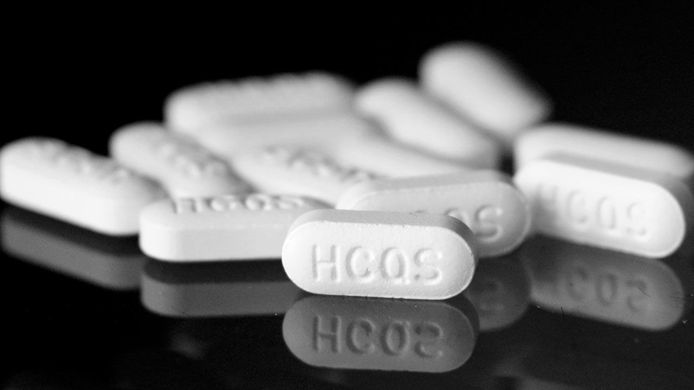

# ML-Project-2-Drug-Sales

  

#### Conclusion

The following final models used on the test dataset, N02BA, and their RMSE and R2 respectively are:
* Linear Regression (RMSE: 36.53, R2: 0.076)

* Polynomial Regression (RMSE: 38.13, R2: -0.007)

* Gradient boosting (RMSE: 45.73, R2: -0.448)

With Linear regression (54% accuracy), polynomial regression, and gradient boosting (99% accuracy) as the best three performing models.

#### Project Goal

The goal for this project was to build regression models that can be used to predict future drug sales of:
* N02BA - Analgesics and antipyretics, Salicylic acid and derivatives

* N05B - Psycholeptics drugs, Anxiolytic drugs

* Apply regression machine learning algorithms:
    * Linear Regression
    * Polynomial Regression
    * SVR
    * Gradient boosting
    * Random Foresting Regression

#### Data Source

This dataset was obtained from [Kaggle!](https://www.kaggle.com/milanzdravkovic/pharma-sales-data?select=salesdaily.csv) Please check out the link if you want to understand what each feature represents in detail.  
 

