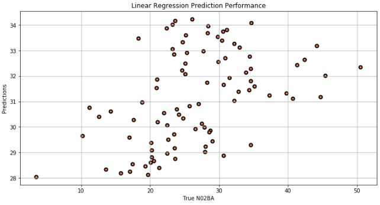

# ML-Project-2-Drug-Sales

#### Project Goal

The goal for this project was to predict future classes of drug sales for the following:
* N02BA - Analgesics and Antipyretics, Salicylic Acid and derivatives

* N05B - Psycholeptics drugs, Anxiolytic drugs

#### Conclusion

There are less consumptions of N05B & N02BA classes of drugs over time. There I would not rely on the final models built to predict drug sales for the classes of drugs I was interested in. I used five different regression models and selected the best three performing models using the results from the cross validation function. The following final models used on the test dataset, N02BA, and their RMSE and R2 respectively are:

* Linear Regression (RMSE: 36.53, R2: 0.076)

* Polynomial Regression (RMSE: 38.13, R2: -0.007)

* Random Forest Regression (RMSE: 48.50, R2: -0.550)

* Gradient Boosting (RMSE: 45.73, R2: -0.448)

With linear regression (54% accuracy), polynomial regression, and gradient boosting (99% accuracy) as the best three performing models.

#### Data Source

This dataset was obtained from [Kaggle!](https://www.kaggle.com/milanzdravkovic/pharma-sales-data?select=salesdaily.csv) Please visit the link if you would like to understand what each feature represents in detail.  
 

